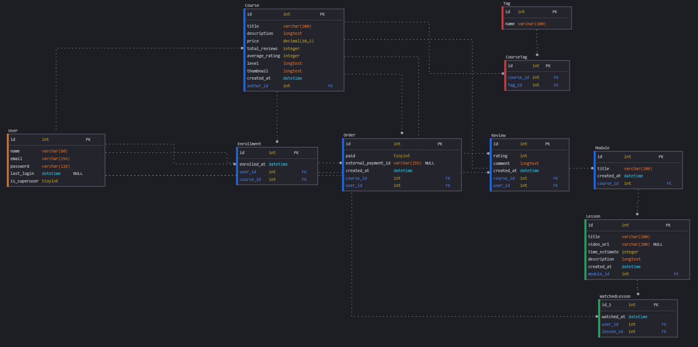

# 🎓 EDUCOM - Sistema de Gestão de Aulas

**EDUCOM** é um sistema completo de gestão educacional voltado ao controle de cursos, módulos, aulas, alunos, matrículas, avaliações e muito mais.

---

## 📌 Funcionalidades Principais

- Cadastro de usuários (alunos, professores e administradores)
- Gerenciamento de cursos e seus módulos
- Controle de aulas com estimativa de tempo e vídeo
- Registro de matrículas e progresso de aprendizado
- Avaliação dos cursos por usuários
- Registro de pedidos e pagamentos

---

## 🧠 Tecnologias

- **Back-end:** Django + Django REST Framework
- **Front-end:** Vue 3 + TypeScript
- **Banco de Dados:** PostgreSQL
- **Containerização:** Docker
- **Versionamento:** Git

---

## 🗃️ Modelo de Dados

A estrutura do banco de dados segue o modelo relacional abaixo:



### 🔍 Descrição das Tabelas

#### `User`
- `id`: Identificador único
- `name`: Nome do usuário
- `email`: E-mail de login
- `password`: Senha criptografada
- `last_login`: Último login
- `is_superuser`: Permissão de administrador

#### `Course`
- `id`: Identificador do curso
- `title`, `description`: Título e descrição do curso
- `price`: Preço do curso
- `total_reviews`, `average_rating`: Métricas de avaliação
- `level`, `thumbnail`: Nível e imagem do curso
- `created_at`: Data de criação
- `author_id`: Criador (FK → User)

#### `Enrollment`
- Representa a **matrícula** de um usuário em um curso
- `user_id` (FK → User)
- `course_id` (FK → Course)

#### `Order`
- Representa um **pedido de compra**
- `paid`: Indica se foi pago
- `external_payment_id`: ID da plataforma de pagamento
- `user_id` (FK → User)
- `course_id` (FK → Course)

#### `Review`
- Avaliação de um curso por um usuário
- `rating`, `comment`
- `user_id` (FK → User)
- `course_id` (FK → Course)

#### `Tag` e `CourseTag`
- Relacionamento N:N entre cursos e tags
- `CourseTag` associa `tag_id` a `course_id`

#### `Module`
- Módulo pertencente a um curso
- `title`, `created_at`, `course_id` (FK → Course)

#### `Lesson`
- Aula de um módulo
- `video_url`, `time_estimate`, `description`
- `module_id` (FK → Module)

#### `WatchedLesson`
- Registro de aula assistida por um usuário
- `user_id` (FK → User)
- `lesson_id` (FK → Lesson)
- `watched_at`: Data/hora em que foi assistida

---

## 🛠️ Como Executar

1. Clone o projeto:

```bash
git clone https://github.com/seu-usuario/educom.git
cd educom
