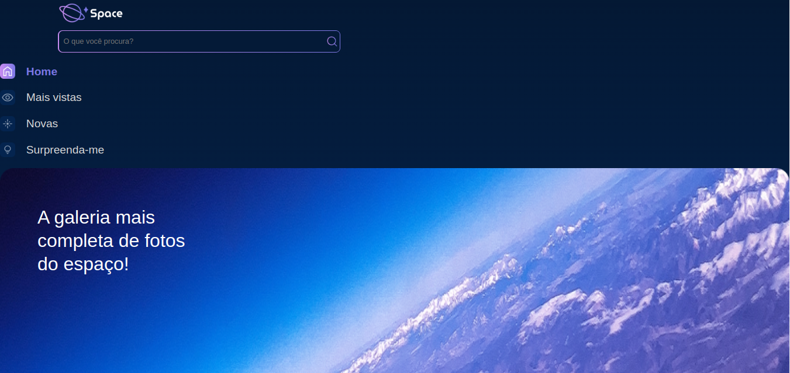

# Repositório de Projetos Django

Este repositório é destinado a guardar diversos projetos desenvolvidos com o framework Django. Ele serve tanto para fins de teste quanto para a realização de trabalhos e experimentos com Django.

<p align="center">
  
</p>

## Estrutura do Repositório

- `venv/`: Ambiente virtual Python utilizado para gerenciar as dependências dos projetos. 
- `manageruser/`: Criando um sistema de gerenciamento de usuários personalizado no Django.

- `space/`: Criando um blog para visualizar fotos do espaço.
<div align="center">
    
</div>


Cada projeto Django possui sua própria estrutura de diretórios e arquivos, incluindo pastas como `migrations`, `static`, `templates`, e outros componentes típicos de um projeto Django.

## Configuração Inicial

1. **Clone o repositório**:
   ```sh
   git clone https://github.com/andersonsimplicio/ProjetosDjango.git
   cd seu_repositorio

2. **Configurando a venv**
   - python -m venv venv
   - source venv/bin/activate
3. **Instalar dependências**
   - pip install -r requirements.txt  
